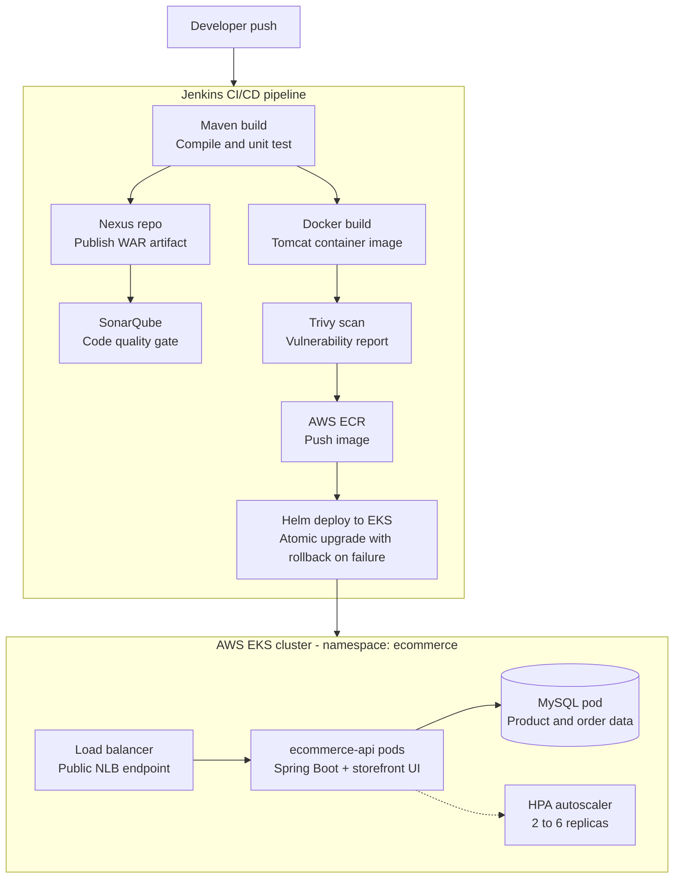

# Enterprise DevOps Platform — us-east-1

## Architecture Diagram

```
┌─────────────────────────────────────────────────────────────────────────┐
│                         CI/CD Pipeline (Jenkins)                        │
│  GitHub → Checkout → Maven Build → Nexus → SonarQube → Docker → Trivy  │
│                                                        → ECR → Helm/EKS │
└─────────────────────────────────────────────────────────────────────────┘
                                    │
                    ┌───────────────▼───────────────┐
                    │     Amazon EKS (us-east-1)     │
                    │  Namespace: ecommerce          │
                    │                                │
                    │  ┌─────────────────────────┐  │
                    │  │    MONOLITH OPTION       │  │
                    │  │  ecommerce-api (WAR)     │  │
                    │  │  Tomcat 10 + JDK 17      │  │
                    │  │  HPA: 2-6 replicas       │  │
                    │  └──────────┬──────────────┘  │
                    │             │                  │
                    │  ┌──────────▼──────────────┐  │
                    │  │   MICROSERVICES OPTION   │  │
                    │  │  product-service (WAR)   │  │
                    │  │  order-service (WAR)     │  │
                    │  │  K8s DNS inter-svc call  │  │
                    │  └──────────┬──────────────┘  │
                    │             │                  │
                    │  ┌──────────▼──────────────┐  │
                    │  │  MySQL RDS / ClusterIP   │  │
                    │  └─────────────────────────┘  │
                    └───────────────────────────────┘
                                    │
                    ┌───────────────▼───────────────┐
                    │  Monitoring Stack              │
                    │  Prometheus → Grafana          │
                    │  JMX Exporter on Tomcat pods   │
                    └───────────────────────────────┘
```

## Why WAR Deployment for Banks and Legacy Enterprises

1. **Compliance and Auditing** — WAR files are discrete, versioned artifacts stored in Nexus. Every deployment is traceable: which WAR, which version, signed and checksummed.
2. **Tomcat Governance** — Many banking environments mandate Apache Tomcat as the approved runtime. Container images wrapping Tomcat respect this mandate without replacing the runtime.
3. **Servlet Container Isolation** — Multiple WARs can run in one Tomcat (shared JVM), or separately, with no changes to existing runbooks.
4. **Nexus Artifact Store** — Enterprises require binaries in an internal repository before production. `maven-releases` prohibits re-deployment, enforcing immutability.
5. **Change-Board Friendly** — A WAR file is a familiar artifact for change managers. Teams submit the exact WAR + version to change boards for sign-off.

## Project Structure

```
enterprise-devops-platform-us-east-1/
├── app-monolith/             Spring Boot WAR — full e-commerce API
├── app-product-service/      Microservice WAR — product catalog + stock
├── app-order-service/        Microservice WAR — orders, calls product-service via K8s DNS
├── jenkins/                  Declarative Jenkinsfile for monolith pipeline
├── jenkins-shared-library/   Reusable pipeline library (deployWarToEKS)
├── helm-monolith/            Helm chart — monolith deployment on EKS
├── helm-product-service/     Helm chart — product-service deployment
├── helm-order-service/       Helm chart — order-service deployment
├── docker-compose/           Local DevOps stack: Nexus, SonarQube, Prometheus, Grafana
└── monitoring/               JMX exporter config + Grafana dashboard JSON
```

## Quick Start — Local DevOps Stack

```bash
cd docker-compose
docker-compose up -d

# Services:
#   Nexus:      http://localhost:8081  (admin / admin123 — first login prompts change)
#   SonarQube:  http://localhost:9000  (admin / admin)
#   Prometheus: http://localhost:9090
#   Grafana:    http://localhost:3000  (admin / admin123)
#   MySQL:      localhost:3306         (root / rootpassword)
```

## Build and Test the Monolith Locally

```bash
cd app-monolith
mvn clean package
# WAR produced: target/ecommerce-api.war

# Run on embedded Tomcat for dev:
mvn spring-boot:run

# Or deploy to local Tomcat:
cp target/ecommerce-api.war $CATALINA_HOME/webapps/
```

## API Testing with curl

### Health Check
```bash
# Monolith or any service
curl http://<LB_DNS>/ecommerce-api/health
# Expected: {"status":"UP","service":"ecommerce-api","version":"1.0.0"}
```

### List All Products
```bash
curl http://<LB_DNS>/ecommerce-api/products
```

### Get Single Product
```bash
curl http://<LB_DNS>/ecommerce-api/products/1
```

### Create a Product
```bash
curl -X POST http://<LB_DNS>/ecommerce-api/products \
  -H "Content-Type: application/json" \
  -d '{
    "name": "Wireless Headphones",
    "price": 199.99,
    "stock": 40,
    "description": "Noise-cancelling Bluetooth headphones"
  }'
```

### Place an Order (with @Transactional stock decrement)
```bash
curl -X POST http://<LB_DNS>/ecommerce-api/orders \
  -H "Content-Type: application/json" \
  -d '{
    "productId": 1,
    "quantity": 2,
    "customerEmail": "customer@enterprise.com"
  }'
# If stock < quantity, HTTP 400 + rollback, no order saved
```

### Microservices — Order via order-service (port-forwards for local testing)
```bash
kubectl -n ecommerce port-forward svc/order-service 8082:80 &
curl -X POST http://localhost:8082/ecommerce-api/orders \
  -H "Content-Type: application/json" \
  -d '{"productId":2,"quantity":1,"customerEmail":"ops@bank.com"}'
```

## Configure Jenkins Credentials

In Jenkins → Manage Jenkins → Credentials → Global, add:

| ID                   | Type                        | Description                              |
|----------------------|-----------------------------|------------------------------------------|
| `github-credentials` | Username/Password or SSH    | GitHub access for Checkout stage         |
| `nexus-credentials`  | Username/Password           | Nexus admin or deploy user               |
| `aws-credentials`    | AWS Credentials (plugin)    | IAM key with ECR + EKS permissions       |
| `SonarQube`          | Secret Text (SonarQube URL) | Configured under Manage Jenkins → SonarQube servers |

### IAM Permissions Required for Jenkins Role
```json
{
  "Effect": "Allow",
  "Action": [
    "ecr:GetAuthorizationToken",
    "ecr:BatchCheckLayerAvailability",
    "ecr:GetDownloadUrlForLayer",
    "ecr:PutImage",
    "ecr:InitiateLayerUpload",
    "ecr:UploadLayerPart",
    "ecr:CompleteLayerUpload",
    "eks:DescribeCluster",
    "eks:UpdateClusterConfig"
  ],
  "Resource": "*"
}
```

## Deploy to EKS Manually

```bash
# Authenticate to EKS
aws eks update-kubeconfig --region us-east-1 --name enterprise-eks-us-east-1

# Create namespace and DB secret
kubectl create namespace ecommerce
kubectl create secret generic ecommerce-db-secret \
  --from-literal=password=apppassword \
  -n ecommerce

# Deploy monolith
helm upgrade --install ecommerce-api ./helm-monolith \
  --namespace ecommerce \
  --set image.tag=1.0.0-1 \
  --atomic --wait

# Deploy microservices
helm upgrade --install product-service ./helm-product-service \
  --namespace ecommerce --atomic --wait

helm upgrade --install order-service ./helm-order-service \
  --namespace ecommerce --atomic --wait

# Get Load Balancer DNS
kubectl get svc -n ecommerce
```

## Import JMX Exporter Prometheus Data into Grafana

1. Open Grafana at `http://localhost:3000`
2. Navigate to **Dashboards → Import**
3. Upload `monitoring/grafana-dashboard.json`
4. Select the `Prometheus` data source
5. Click **Import**

The dashboard shows: HTTP request rate, error rate, Tomcat active threads, JVM heap usage, GC rate, thread count, average response time, CPU load, and non-heap memory.

## Using the Jenkins Shared Library

```groovy
// In any repo's Jenkinsfile:
@Library('devops-pipeline-library') _

deployWarToEKS(
    appName:    'product-service',
    appVersion: '1.0.0',
    appDir:     'app-product-service',
    nexusUrl:   'http://nexus:8081/repository/maven-releases',
    ecrRepo:    '123456789012.dkr.ecr.us-east-1.amazonaws.com/product-service',
    helmChart:  'helm-product-service',
    namespace:  'ecommerce'
)
```

Register the library in Jenkins → Manage Jenkins → Configure System → Global Pipeline Libraries:
- Name: `devops-pipeline-library`
- Source: Git URL of this repo, branch: `main`
- Library path: `jenkins-shared-library`

## Pipeline flow diagram


