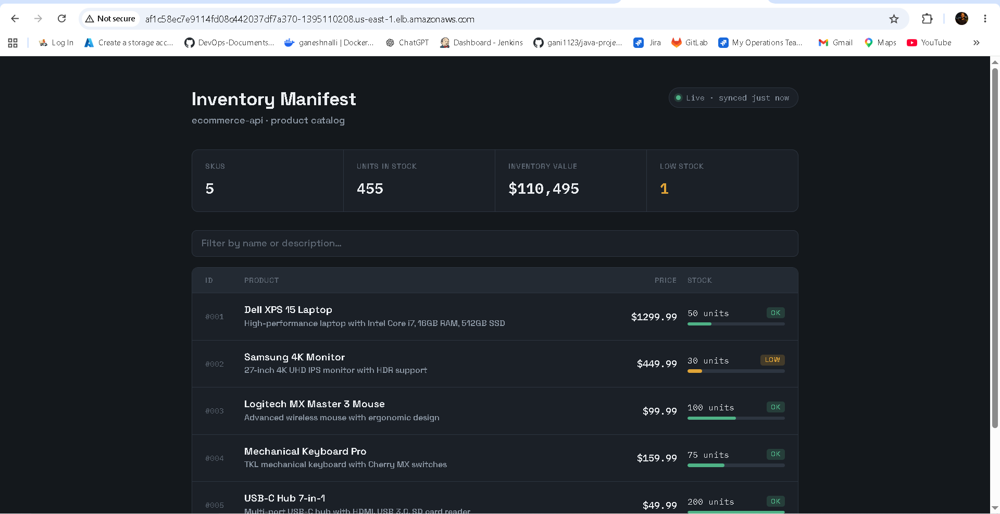

# 🚀 Enterprise DevOps Platform — E-Commerce on AWS EKS

> **End-to-end CI/CD platform** for Java WAR-based microservices — built with Jenkins Shared Libraries, AWS EKS, Helm, and a full DevSecOps toolchain.

---

## 📸 Live Application



> Real-time inventory dashboard deployed on AWS EKS — 5 SKUs • 455 units in stock • $110,495 inventory value • Live stock alerts

---

## 🏗️ Architecture Overview

```
GitHub → Jenkins → Maven Build → Nexus → SonarQube → Docker → Trivy → ECR → EKS (Helm)
```

| Layer | Tool |
|---|---|
| Source Control | GitHub |
| CI/CD Orchestration | Jenkins + Shared Library |
| Build | Maven 3.9 + JDK 17 |
| Artifact Management | Nexus Repository |
| Code Quality | SonarQube |
| Containerization | Docker |
| Security Scanning | Trivy |
| Container Registry | AWS ECR |
| Deployment | AWS EKS + Helm |
| Monitoring | Prometheus + Grafana |
| Notifications | Slack + Email |

---

## 📁 Repository Structure

```
Enterprise-devops-platform-ecommerce-eks/
├── app-monolith/               # Core Spring Boot WAR application
├── app-order-service/          # Order processing microservice
├── app-product-service/        # Product catalog microservice
├── helm-monolith/              # Helm chart — monolith
├── helm-order-service/         # Helm chart — order service
├── helm-product-service/       # Helm chart — product service
├── jenkins/                    # Jenkinsfile pipeline definition
├── jenkins-shared-library/     # Reusable shared library (Groovy)
├── vars/                       # Shared library functions
│   ├── checkoutCode.groovy
│   ├── buildWar.groovy
│   ├── nexusUpload.groovy
│   ├── sonarScan.groovy
│   ├── dockerBuild.groovy
│   ├── trivyScan.groovy
│   ├── dockerPush.groovy
│   ├── deployEKS.groovy
│   ├── deployWarToEKS.groovy
│   ├── updateHelm.groovy
│   ├── cleanup.groovy
│   ├── slackNotification.groovy
│   └── emailNotification.groovy
├── k8s/                        # Raw Kubernetes manifests
├── monitoring/                 # Prometheus + Grafana setup
├── docker-compose/             # Local development environment
├── resources/                  # Pipeline resources & configs
└── src/com/company             # Shared library source classes
```

---

## 📚 Jenkins Shared Library — Core Design

Instead of monolithic Jenkinsfiles, this project uses a **reusable Jenkins Shared Library** (`devops-pipeline-library`). Each stage calls a dedicated Groovy function — making pipelines clean, DRY, and reusable across multiple applications.

### Why Shared Libraries?

| Without Shared Library | With Shared Library |
|---|---|
| 300+ line Jenkinsfile per app | 50-line Jenkinsfile per app |
| Copy-paste logic across teams | Single source of truth |
| Hard to update pipeline logic | Change once, applies everywhere |
| Inconsistent standards | Enforced standards across all apps |

### Available Functions

| Function | Purpose |
|---|---|
| `checkoutCode()` | Git checkout with credentials |
| `buildWar()` | Maven WAR build + unit tests |
| `nexusUpload()` | Publish artifact to Nexus |
| `sonarScan()` | SonarQube static code analysis |
| `dockerBuild()` | Build Docker image |
| `trivyScan()` | Trivy container vulnerability scan |
| `dockerPush()` | Push image to AWS ECR |
| `deployEKS()` | Helm-based rolling deploy to EKS |
| `updateHelm()` | Update Helm chart image tag |
| `cleanup()` | Remove local Docker images post-deploy |
| `slackNotification()` | Slack build status alerts |
| `emailNotification()` | Email build status alerts |

---

## ⚙️ CI/CD Pipeline — 8 Stages

```groovy
@Library('devops-pipeline-library') _

pipeline {
  stages {
    stage('Checkout')            // Pull code from GitHub
    stage('Build WAR')           // Maven build + unit tests
    stage('Publish to Nexus')    // Upload WAR artifact
    stage('SonarQube Scan')      // Code quality gate
    stage('Docker Build')        // Build container image
    stage('Trivy Scan')          // Security vulnerability scan
    stage('Push to ECR')         // Push to AWS container registry
    stage('Deploy to EKS')       // Helm rolling deployment
  }
}
```

**Pipeline Features:**
- ⏱️ 60-minute timeout with timestamps
- 🔄 Rolling deployments — zero downtime
- 🧹 Automatic cleanup of local images post-deploy
- 📧 Slack + Email notifications on success/failure
- 🔒 All credentials via Jenkins credential store — no hardcoded secrets

---

## ☸️ Kubernetes — EKS Deployment

**Cluster:** `enterprise-eks-us-east-1`
**Namespace:** `ecommerce`

```bash
# Verify deployment
kubectl get pods -n ecommerce
kubectl get svc -n ecommerce
kubectl get hpa -n ecommerce
```

**Auto Scaling (HPA):**
- Minimum replicas: 2
- Maximum replicas: 6
- Scale trigger: CPU utilization

**Deployment Strategy:** Rolling update — zero downtime during every release.

---

## 📊 Monitoring Stack

Monitoring setup lives in the `monitoring/` folder:

- **Prometheus** — metrics collection from EKS pods
- **Grafana** — dashboards for CPU, memory, pod health
- Alerts configured for pod crash, high CPU, deployment failures

---

## 🔐 DevSecOps — Security at Every Layer

Security is **not a final gate** — it's integrated throughout the pipeline:

| Stage | Tool | What It Checks |
|---|---|---|
| Code commit | SonarQube | Code quality, bugs, vulnerabilities, coverage |
| Container build | Trivy | OS packages, dependency CVEs in Docker image |
| AWS access | IAM Roles | No long-lived credentials — role-based auth only |
| Registry | ECR | Private registry with IAM-controlled access |

> Pipeline **automatically fails** if Trivy detects CRITICAL vulnerabilities — image is never pushed to ECR.

---

## 🧩 Microservices

| Service | Description | Tech Stack |
|---|---|---|
| `app-monolith` | Core e-commerce WAR app | Spring Boot, Java 17 |
| `app-order-service` | Order processing REST API | Spring Boot |
| `app-product-service` | Product catalog REST API | Spring Boot |

Each service has its own Helm chart, ECR repository, and independent pipeline.

---

## 🚀 How to Run Locally

```bash
# Clone the repo
git clone https://github.com/gani1123/Enterprise-devops-platform-ecommerce-eks.git

# Start local environment
cd docker-compose
docker-compose up -d

# Verify services
docker ps
```

---

## 📊 Key Metrics

| Metric | Value |
|---|---|
| Pipeline stages | 8 end-to-end |
| Shared library functions | 13 reusable Groovy functions |
| Microservices deployed | 3 (monolith + order + product) |
| Deployment strategy | Rolling (zero downtime) |
| Security gates | Trivy + SonarQube — blocks on CRITICAL |
| Auto-scaling range | 2 → 6 replicas (CPU-based HPA) |

---

## 🔮 Roadmap

- [ ] ArgoCD GitOps — replace Jenkins deploy stage
- [ ] Ingress Controller + Route53 custom domain
- [ ] HTTPS via AWS ACM
- [ ] Canary deployments via Argo Rollouts
- [ ] Centralized secrets with HashiCorp Vault

---

## 👨‍💻 Author

**Ganesh Nalli** — AWS DevOps Engineer
🔗 [LinkedIn](https://linkedin.com/in/ganeshnalli) • [GitHub](https://github.com/gani1123)
📧 ganeshnalli.devops@gmail.com
